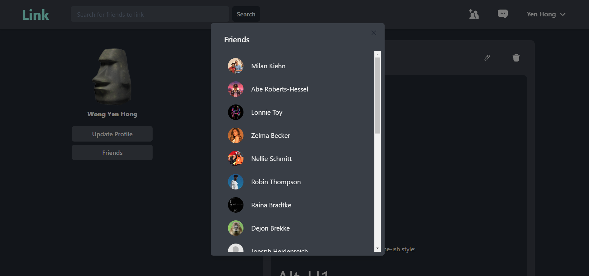

# Link : A Social Platform for Connecting with Friends

[Link](https://link-social.netlify.app/) is a social platform designed to facilitate seamless connectivity between individuals and their friends. 

**Note: Cookies must be enabled to access Link's full functionality.**

## Key Features

### Authentication
Link prioritizes the security of user information. User passwords are encrypted using the industry-standard [bcrypt.js](https://www.npmjs.com/package/bcryptjs) library, ensuring sensitive data remains safe and protected. Additionally, authorization is achieved through the utilization of [JSON Web Tokens (JWT)](https://www.npmjs.com/package/jsonwebtoken), providing a secure and efficient method for verifying user identity.

### Email Verification
To enhance user trust and security, Link incorporates an email verification system. By utilizing [nodemailer](https://www.npmjs.com/package/nodemailer) , the platform sends verification emails to users during the registration process, ensuring that only legitimate and verified accounts gain access.

### Real-time Chatting 
Link leverages the power of [socket.io](https://socket.io/) a library that supports low-latency, bidirectional communication.

### Markdown & LaTeX Support
Link goes beyond standard text input by integrating the capability to render Markdown and LaTeX. Utilizing the [marked](https://marked.js.org/) library for Markdown and [katex](https://katex.org/) for LaTeX, users can express themselves with rich text formatting and mathematical notations, fostering a diverse range of interactions and discussions.

### Partial Searching
To enable efficient user discovery, Link uses dynamic programming to compute the similarity between two strings using the edit distance algorithm. This approach facilitates partial searching, allowing users to find others with similar names, streamlining the process of connecting with friends.

## Tech Stack

Front-End: React.js, HTML, CSS, Chakra-UI
  
Back-End: Node.js, Express.js, MongoDB, Mongoose, SuperTest
 
Authentication: bcrypt.js, JSON Web Token
 
Real-time Chat: socket.io
 
Rich Text Support: marked, katex
 
Deployment: Netlify, Railway

## Live Demo

https://link-social.netlify.app/

## Screenshots

